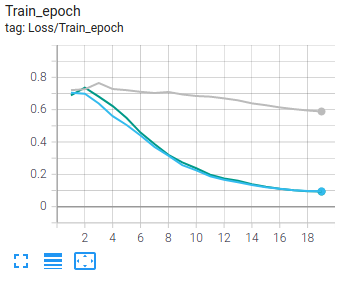
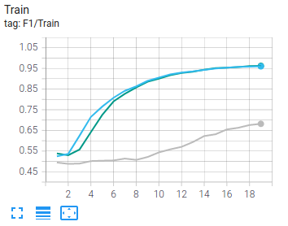
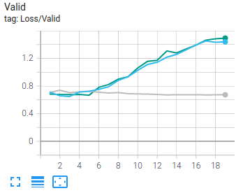

# Compare
Màu xanh lam : Model với multihead attn question-context + multihead attn question-question trên bilstm  
Màu xanh lá  : Model với multihead attn question-context  
Màu hồng     : Original model  

  

# Setup
Yêu cầu:
* docker

Setup env:
* Build docker image: `docker-compose build gpu`
* Create docker container: `docker-compose build gpu` và truy cập jupyter notebook server với address có trong terminal

Training:
* Run notebook `DrQA.ipynb` với các config (dataset đã được chuẩn bị trước, xem kĩ hơn tại `dataset/qaset/`)

Logger:
* Run notebook `TensorboardLogger`, cần đặt tên cho experiemnt khi training để dễ phân biệt
