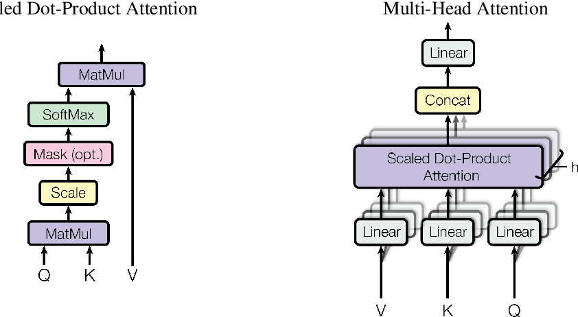

# DrQA with Multihead Attention
Dựa trên paper [Reading Wikipedia to Answer Open-Domain Questions](https://arxiv.org/abs/1704.00051) - Danqi Chen, Adam Fisch, Jason Weston, Antoine Bordes

# So sánh
Màu xanh lam : Model với multihead attn question-context + multihead attn question-question trên bilstm  
Màu xanh lá  : Model với multihead attn question-context  
Màu hồng     : Base model  

  

Multiheed attention được implement dựa theo paper [Attention Is All You Need](https://arxiv.org/abs/1706.03762) - Ashish Vaswani, Noam Shazeer, Niki Parmar, Jakob Uszkoreit, Llion Jones, Aidan N. Gomez, Lukasz Kaiser, Illia Polosukhin

  

# Setup
Yêu cầu:
* docker

Setup env:
* Build docker image: `docker-compose build gpu`
* Create docker container: `docker-compose build gpu` và truy cập jupyter notebook server với address có trong terminal

Training:
* Run notebook `DrQA.ipynb` với các config (dataset đã được chuẩn bị trước, xem kĩ hơn tại `dataset/qaset/`)

Logger:
* Run notebook `TensorboardLogger`, cần đặt tên cho experiemnt khi training để dễ phân biệt
